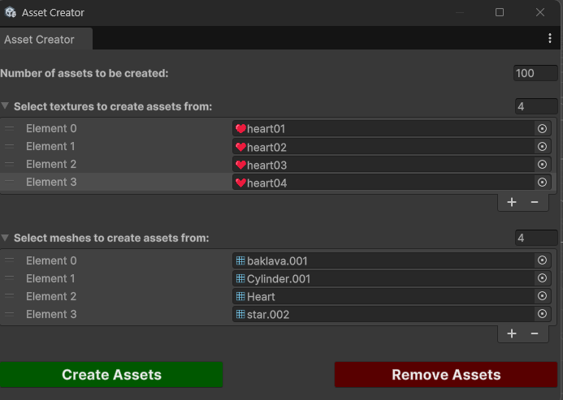
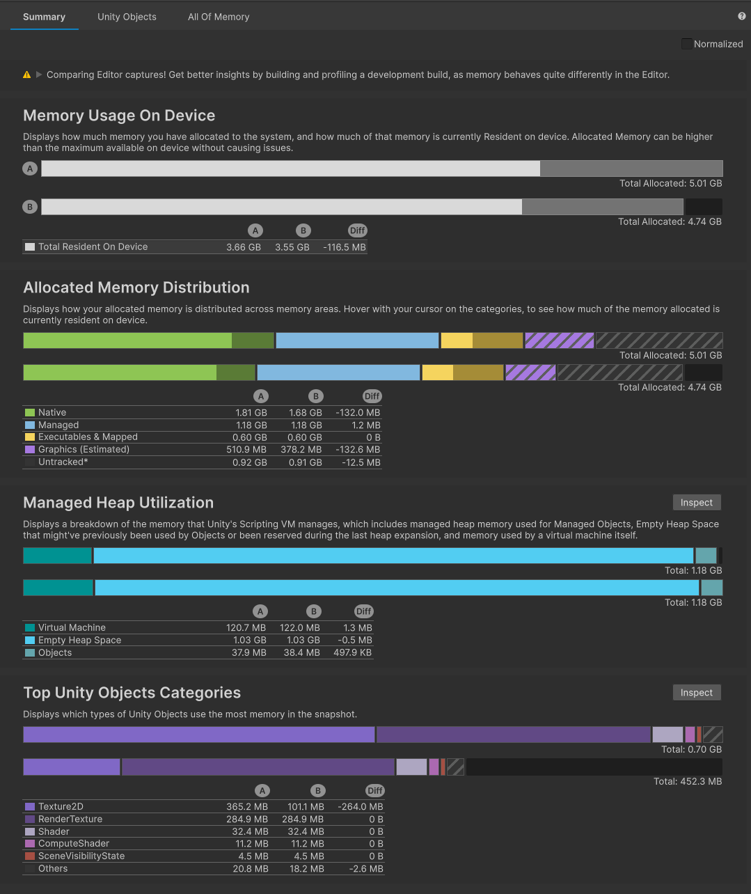
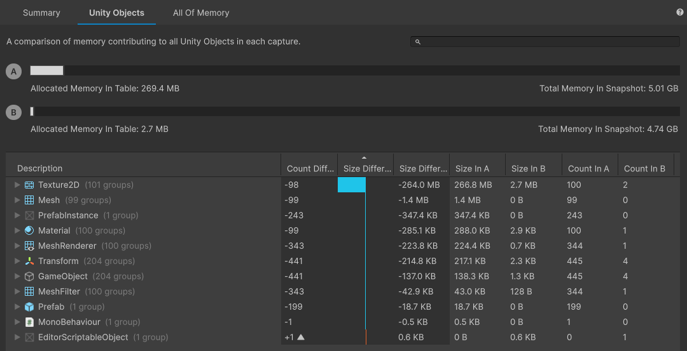
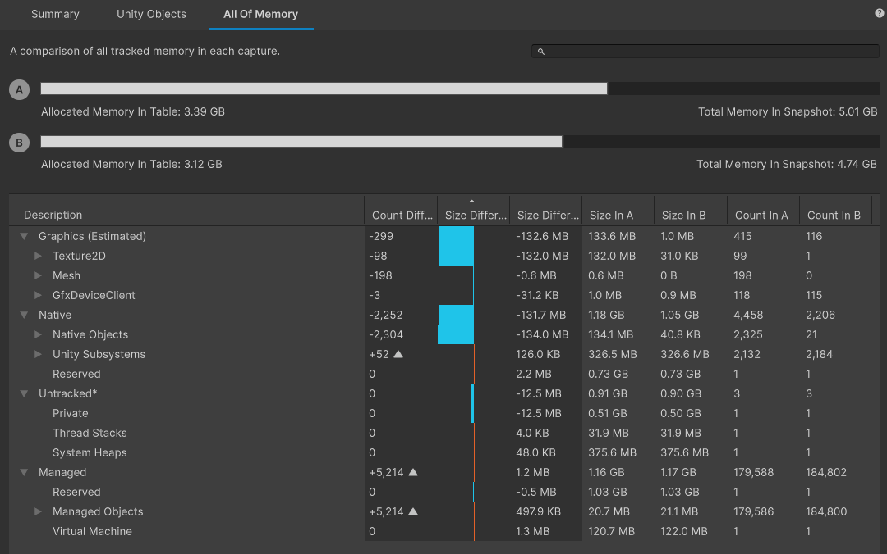

# Unity Addressables Examples

According to the official [documentation](https://docs.unity3d.com/Packages/com.unity.addressables@2.3/manual/index.html) the Addressables package provides tools and scripts to organize and package content for your application. The Addressables system builds on Unity's AssetBundles, but provides a better and easier way to organize bundles by groups.

Addressables package has two main usage areas:
* Managing the content (assets) of your game in a better way including both local and remote contents.
* Managing runtime memory usage by loading assets manually.
This repository focuses on the runtime memory usage of the content and provides an example case for it.

**Note:** In Unity, while loading a scene, each asset which has a reference (direct or indirect) in the scene is loaded to memory automatically. This means that, each referenced asset consumes memory even if the it isn’t instantiated yet. On the other hand, Addressable assets are loaded manually and don’t consume any memory until they are loaded. 

## Asset Creator

There are huge number of assets are needed to be able to test the memory usage of the content properly. Since founding or creating hundreds of unique assets is not always feasible, duplicating a couple of root assets to create many of them seems like a better option.
Asset creator duplicates assets to be able to create huge number of assets. You can open asset creator window by Window -> Asset Creator.

## Groups And and Bundles

The addressable system puts each asset (the ones marked as addressable) in a group. For each group there are two packing options such as pack together and pack separately. If the group is packed together, then every asset of the group will be packed into a single Asset Bundle. Otherwise, each asset will be packed into a unique Asset Bundle. Both options have its own advantages and disadvantages (for details please check the [documentation](https://docs.unity3d.com/Packages/com.unity.addressables@2.3/manual/index.html)).

In this example every group is packed separately to be able to reduce runtime memory usage as much as possible. However, packing each group separately and having huge number of Asset Bundles is not something good. So, please be aware of that packing strategy of this example repository is not the best way. Every game is unique, so please build a wise grouping and packing strategy for your game by considering loading times, memory usages and build sizes.

## Test Cases

There are 3 test cases in the repository. Each case has its own scene.
* **Default Case:** It uses Unity’s built-in asset management system.
* **Addressables (Asset Reference):** It uses Addressables system with asset references. The scene isn’t marked as Addressable.
* **Addressables (Addressable Scene):** Same with the second case, but the scene is marked as Addressable.

**Note:** If a scene is marked as Addressable, then Addressable assets can be assigned to fields of built-in components (Mesh Filter, Rigidbody, etc.) in the scene.

## Results

Following screenshots which are taken from [Memory Profiler](https://docs.unity3d.com/Packages/com.unity.memoryprofiler@1.1/manual/index.html) shows the memory usage of both cases. “A” represent the Default Case and “B” represents Addressables (Asset Reference) case.

Two Addressable cases (with and without Addressable scene) results with similar memory consumption, so only one Addressable case was added to screenshots.
## Comments

If a scene has too many referenced assets, then it is loaded slowly and consumes too much memory because of automatically loaded assets. As you can see clearly in the results, Addressables system solves this problem by loading assets manually only when they actually needed. 

On the other hand, it needs extra work hours to implement it (even if it isn’t too hard to implement it). Also, for large projects which have too many assets, managing those assets in asset groups and building a wise packing strategy needs caution and takes time. So, use Addressables only when you really need it and consider partial implementation (adding assets only which consumes too much memory to the Addressables system instead of adding all assets to the system).
